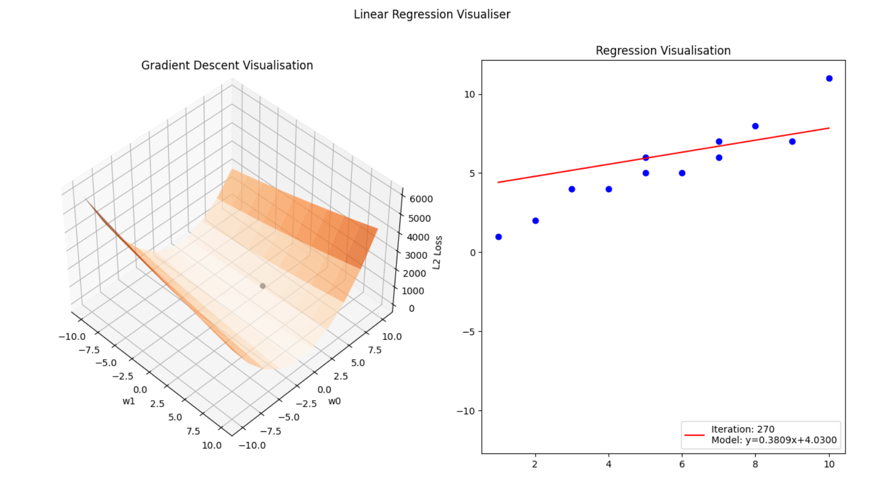
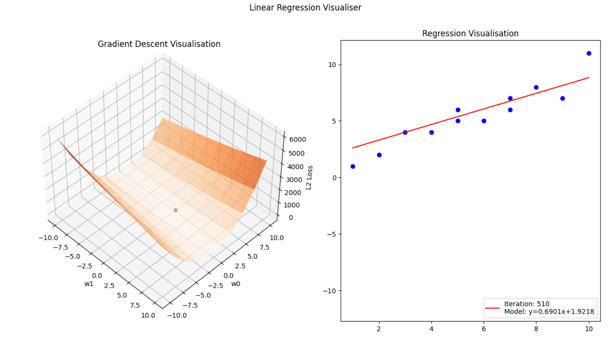
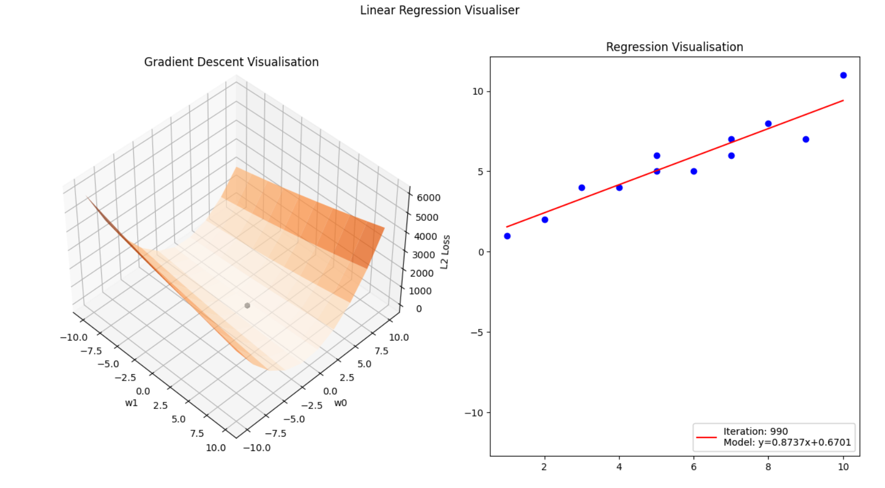
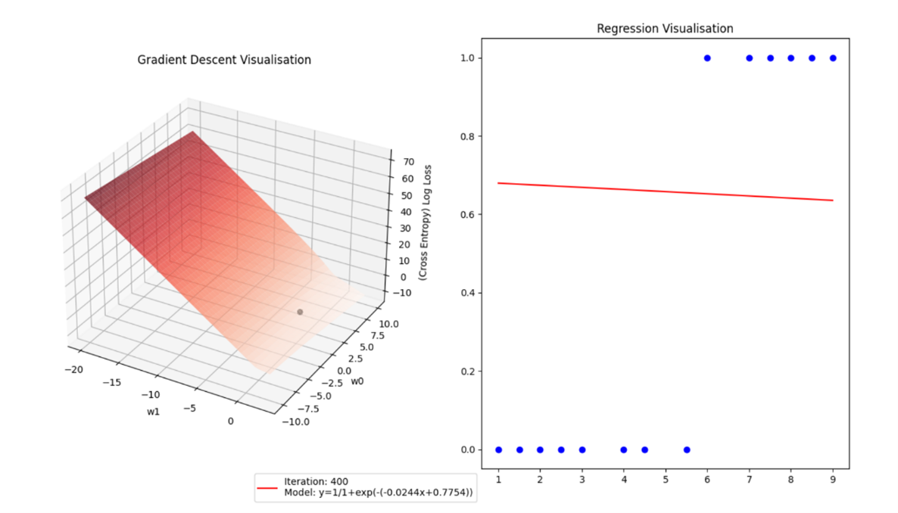
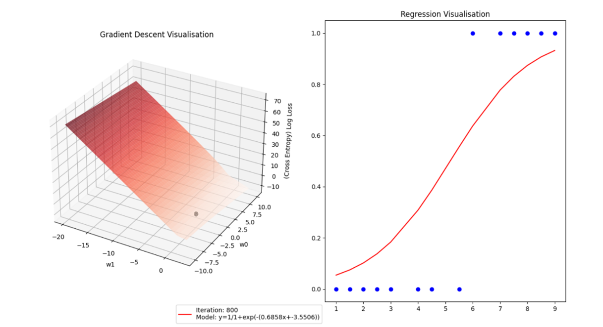
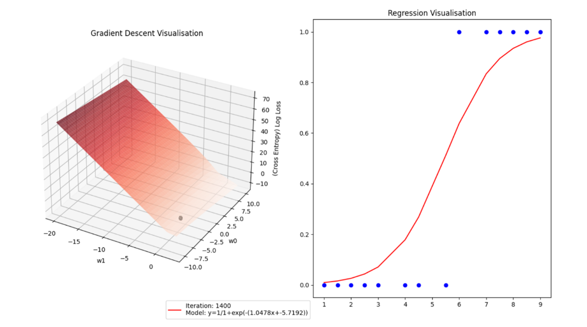
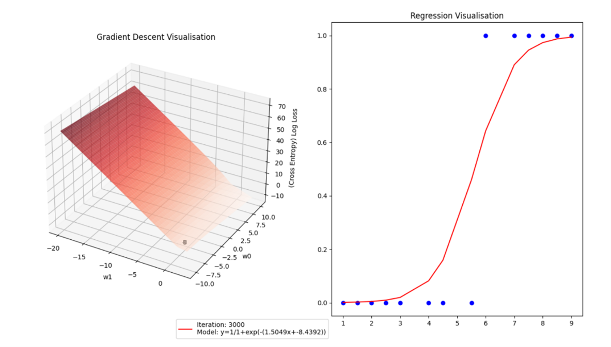

# Machine Learning Visualisers

Linear Regression & Logistic regression, two commonly used supervised machine leanrning algorithms will be implemented and visualised

For each algorithm the following will be shown:
- A gradient descent animation, where the loss function is finding the optimal solution (local minima)
- A animation showing the model learning what the best fit of the data-set is

## Linear Regression 

Model used: 

Loss function used - L2 Loss: 

During gradient descent, we take partial derivatives of our loss function with respect to each weight

We then use these values to continuously update our weights until convergence

### Example visualisation over a given dataset:

<table>
  <tr>
    <td>On the 60th iteration</td>
    <td>On the 270th iteration</td>
  </tr>
    <tr>
    <td>On the 510th iteration</td>
    <td>On the 990th (final) iteration</td>
  </tr>
 </table>
 
 
## Logistic Regression 

Model used - Sigmoid function: 

Loss function used - Cross entropy loss function:

Each of our weights are updated until convergence:

### Example visualisation over a given dataset:

<table>
  <tr>
    <td>On the 400th iteration</td>
    <td>On the 800th iteration</td>
  </tr>
    <tr>
    <td>On the 1400th iteration</td>
    <td>On the 3000th iteration</td>
  </tr>
 </table>
 
## Imported Libraries:

- matplotlib
- numpy
- celluloid
- scipy
- random

