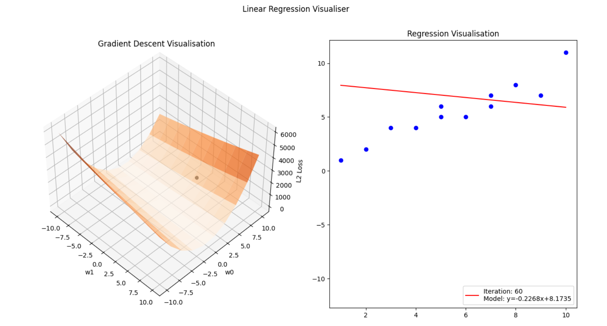

# Gradient Descent 3D visualisations

3D visualisations of the optimisation process used to minimise the loss function of a machine learning model
- The process of gradient descent is displayed on the left showing how the optimal weights are found
- The animation on the right shows our model fitting the data based on the weights found from the gradient descent process

## Example Animations

### Minimising the Mean Squared Error loss function for linear regression:

<table>
  <tr>
    <td>On the 60th iteration</td>
    <td>On the 270th iteration</td>
  </tr>
    <tr>
    <td>On the 510th iteration</td>
    <td>On the 990th (final) iteration</td>
  </tr>
 </table>
 
 
### Minimising the Cross Entropy loss function for logistic regression:

<table>
  <tr>
    <td>On the 400th iteration</td>
    <td>On the 800th iteration</td>
  </tr>
    <tr>
    <td>On the 1400th iteration</td>
    <td>On the 3000th iteration</td>
  </tr>
 </table>
 
## Imports:

- Matplotlib
- NumPy
- Celluloid
- SciPy
